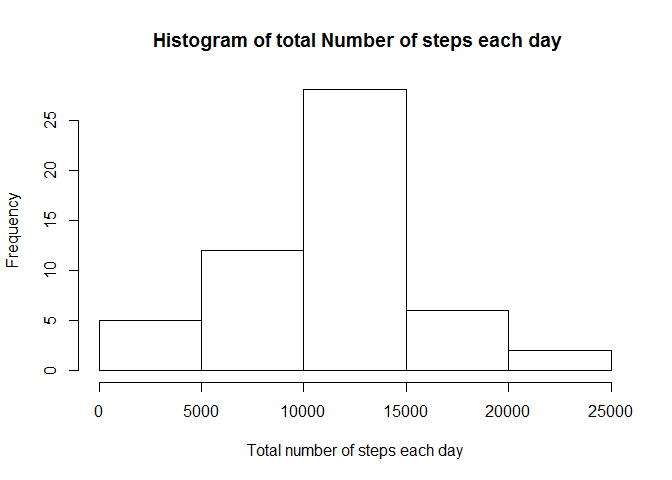
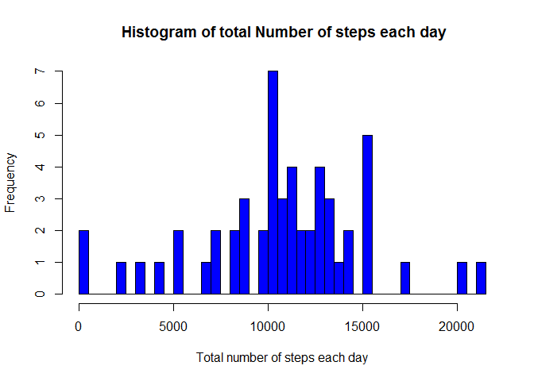
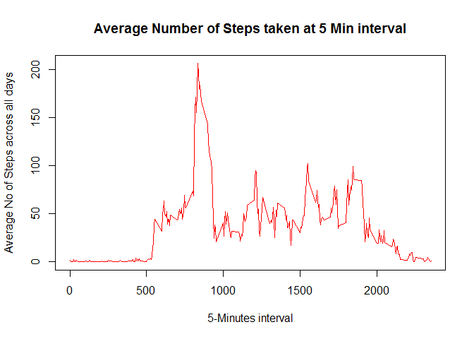
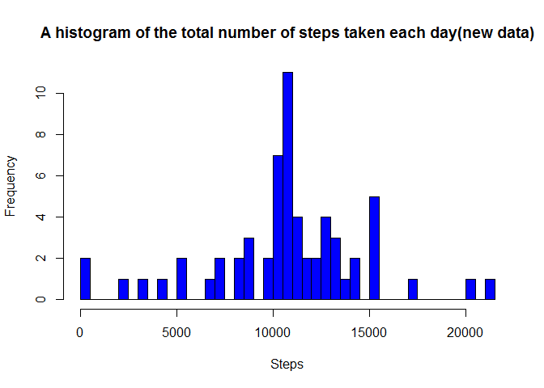
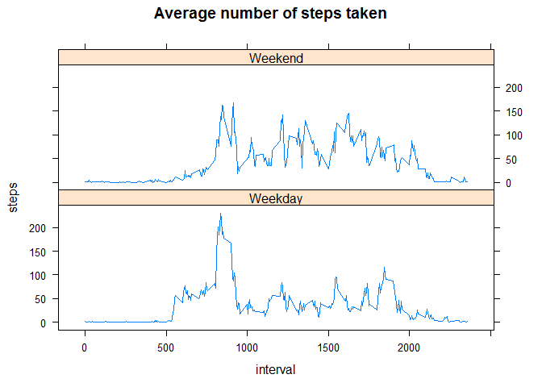

Reproducible Research : Peer-graded Assignment: Course Project 1
----------------------------------------------------------------

### Loading and preprocessing the data

Show any code that is needed to Load the data Process/transform the data
(if necessary) into a format suitable for your analysis \#\#\#\# 1. Code
for reading in the dataset and/or processing the data Loading the data
for processing into data frame "activity"

    activity<-read.csv("activity.csv" , stringsAsFactors = FALSE, na.strings = "NA"  )

See the summary

    summary(activity)

    ##      steps            date              interval     
    ##  Min.   :  0.00   Length:17568       Min.   :   0.0  
    ##  1st Qu.:  0.00   Class :character   1st Qu.: 588.8  
    ##  Median :  0.00   Mode  :character   Median :1177.5  
    ##  Mean   : 37.38                      Mean   :1177.5  
    ##  3rd Qu.: 12.00                      3rd Qu.:1766.2  
    ##  Max.   :806.00                      Max.   :2355.0  
    ##  NA's   :2304

    str(activity)

    ## 'data.frame':    17568 obs. of  3 variables:
    ##  $ steps   : int  NA NA NA NA NA NA NA NA NA NA ...
    ##  $ date    : chr  "2012-10-01" "2012-10-01" "2012-10-01" "2012-10-01" ...
    ##  $ interval: int  0 5 10 15 20 25 30 35 40 45 ...

Examin data using head command

    head(activity,10)

    ##    steps       date interval
    ## 1     NA 2012-10-01        0
    ## 2     NA 2012-10-01        5
    ## 3     NA 2012-10-01       10
    ## 4     NA 2012-10-01       15
    ## 5     NA 2012-10-01       20
    ## 6     NA 2012-10-01       25
    ## 7     NA 2012-10-01       30
    ## 8     NA 2012-10-01       35
    ## 9     NA 2012-10-01       40
    ## 10    NA 2012-10-01       45

Check for NAs - missing values

    sum(!is.na(activity$steps))

    ## [1] 15264

    sum(is.na(activity$date))

    ## [1] 0

    sum(is.na(activity$interval))

    ## [1] 0

### What is mean total number of steps taken per day?

For this part of the assignment, you can ignore the missing values in
the dataset.

#### 1. Calculate the total number of steps taken per day

    totalSteps<-aggregate(steps~date,data=activity,sum,na.rm=TRUE)

#### 2. Histogram of the total number of steps taken each day

    hist(totalSteps$steps, xlab = "Total number of steps each day", ylab = "Frequency", main = " Histogram of total Number of steps each day")

Histogram with breaks=50 and color=blue

    hist(totalSteps$steps, xlab = "Total number of steps each day", ylab = "Frequency", main = " Histogram of total Number of steps each day", breaks = 50, col = "blue")

#### 3. Calculate and report the mean and median of the total number of steps taken per day

    mean(totalSteps$steps)

    ## [1] 10766.19

    median(totalSteps$steps)

    ## [1] 10765

### What is the average daily activity pattern?

#### 1. Make a time series plot (type="l") of the 5-minute interval (x-axis) and the average number of steps taken, averaged across all days (y-axis)

    avg_steps_by_interval<-aggregate(steps~interval, data = activity, mean, na.rm =TRUE)
    plot(x=avg_steps_by_interval$interval, y = avg_steps_by_interval$steps, xlab = "5-Minutes interval",ylab= "Average No of Steps across all days" , type = "l", col = "red" , main = "Average Number of Steps taken at 5 Min interval")

### 2. Which 5-minute interval, on average across all the days in the dataset, contains the maximum number of steps?

    library(dplyr)

    ## 
    ## Attaching package: 'dplyr'

    ## The following objects are masked from 'package:stats':
    ## 
    ##     filter, lag

    ## The following objects are masked from 'package:base':
    ## 
    ##     intersect, setdiff, setequal, union

    select(filter(avg_steps_by_interval, avg_steps_by_interval$steps==max(avg_steps_by_interval$steps)) , 1)

    ##   interval
    ## 1      835

Imputing missing values
-----------------------

Note that there are a number of days/intervals where there are missing
values (coded as NA). The presence of missing days may introduce bias
into some calculations or summaries of the data.

### 1.Calculate and report the total number of missing values in the dataset (i.e. the total number of rows with NAs)

    nrow(activity[is.na(activity$steps),])

    ## [1] 2304

### 2.Devise a strategy for filling in all of the missing values in the dataset. The strategy does not need to be sophisticated. For example, you could use the mean/median for that day, or the mean for that 5-minute interval, etc.

#### Create new data frame from original and replace steps NAs with the mean for that 5-minute interval

    # create new dataframe from original
    new_activity<-activity
    missing <- new_activity[is.na(new_activity$steps),]
    missing_index <- match(missing$interval,avg_steps_by_interval$interval)
    #Replacing NAs with the mean for that 5-minute interval
    new_activity$steps[is.na(new_activity$steps)] <- avg_steps_by_interval$steps[missing_index]

### 3.Create a new dataset that is equal to the original dataset but with the missing data filled in.

#### New Data set "new\_activity"

    head(new_activity,10)

    ##        steps       date interval
    ## 1  1.7169811 2012-10-01        0
    ## 2  0.3396226 2012-10-01        5
    ## 3  0.1320755 2012-10-01       10
    ## 4  0.1509434 2012-10-01       15
    ## 5  0.0754717 2012-10-01       20
    ## 6  2.0943396 2012-10-01       25
    ## 7  0.5283019 2012-10-01       30
    ## 8  0.8679245 2012-10-01       35
    ## 9  0.0000000 2012-10-01       40
    ## 10 1.4716981 2012-10-01       45

### 4.Make a histogram of the total number of steps taken each day and Calculate and report the mean and median total number of steps taken per day. Do these values differ from the estimates from the first part of the assignment? What is the impact of imputing missing data on the estimates of the total daily number of steps?

    new_total_steps<- aggregate(new_activity$steps, by = list(new_activity$date), sum, na.rm = TRUE)
    colnames(new_total_steps)<-c("Date", "Steps")

    hist(new_total_steps$Steps, breaks = 50, xlab="Steps", ylab="Frequency" , col="blue" , main = "A histogram of the total number of steps taken each day(new data)")

    #Mean
    mean_steps_new<-round(mean(new_total_steps$Steps),0)
    print(mean_steps_new)

    ## [1] 10766

    #Median
    median_steps_new<-median(new_total_steps$Steps)
    print(median_steps_new)

    ## [1] 10766.19

New Mean total steps taken per day : 10766

New Median total steps taken per day: 10766

New mean and median are equal to each other and slightly larger in value
compared to old values.

Also, the new histogram appears to be normally distributed around mean.

Are there differences in activity patterns between weekdays and weekends?
-------------------------------------------------------------------------

For this part the weekdays() function may be of some help here. Use the
dataset with the filled-in missing values for this part.

### 1. Create a new factor variable in the dataset with two levels - "weekday" and "weekend" indicating whether a given date is a weekday or weekend day.

    day_type<-weekdays(as.Date(new_activity$date), abbreviate = TRUE)
    day_type<-ifelse(day_type %in% c("Sun" , "Sat"), yes = "Weekend", "Weekday")
    new_activity$day_type<-as.factor(day_type)
    day_wise_steps<-aggregate(new_activity$steps, by = list(new_activity$interval, new_activity$day_type), mean, na.rm = TRUE)
    colnames(day_wise_steps)<-c("interval", "day_type", "steps")
    head(day_wise_steps,10)

    ##    interval day_type      steps
    ## 1         0  Weekday 2.25115304
    ## 2         5  Weekday 0.44528302
    ## 3        10  Weekday 0.17316562
    ## 4        15  Weekday 0.19790356
    ## 5        20  Weekday 0.09895178
    ## 6        25  Weekday 1.59035639
    ## 7        30  Weekday 0.69266247
    ## 8        35  Weekday 1.13794549
    ## 9        40  Weekday 0.00000000
    ## 10       45  Weekday 1.79622642

### 2. Make a panel plot containing a time series plot (i.e. type="l") of the 5-minute interval (x-axis) and the average number of steps taken, averaged across all weekday days or weekend days (y-axis). See the README file in the GitHub repository to see an example of what this plot should look like using simulated data.

    xyplot(steps ~ interval | day_type, data = day_wise_steps, type = "l", layout = c(1,2) ,main = "Average number of steps taken")

During weekend, number of steps are more uniformally distributed between
800 and 2000.

During weekdays, majority of the steps are concentrated between 800 and
1000.
